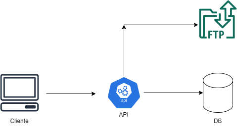

# Image-Repo

An API that allows the buy and sell of images.

## Goal

Build a Image Repository that simulate a marketplace of images.

## Technologies Used
<ol>
  <li><a href="https://spring.io/projects/spring-boot">Spring Boot</a></li>
  <li><a href="https://spring.io/projects/spring-data-jpa">Spring JPA</a></li>
  <li><a href="https://projectlombok.org/">Lombok</a></li>
  <li><a href="https://www.postgresql.org/">PostgreSQL</a></li>
  <li><a href="https://www.docker.com/">Docker</a></li>
  <li><a href="https://hub.docker.com/r/atmoz/sftp">SFTP</a></li>
</ol>

## Diagram



## How To Run :fire:

Just execute the command below on the root folder :

```
>  docker-compose build

>  docker-compose up

```
The project will start running on port 8080,the default settings can be changed in docker-compose.yml file.


# How To Use

Export the file Image Repository.postman_collection.json to your postman application.

# 📁 Collection: UserController


## End-point: Create User

### Description: Create a user from a email and password.

Method: POST

>```
>http://localhost:8080/api/v1/user
>```

### Body (**raw**)

```json
{
    "email": {userEmail},
    "password": {userPassword}
}
```


⁃ ⁃ ⁃ ⁃ ⁃ ⁃ ⁃ ⁃ ⁃ ⁃ ⁃ ⁃ ⁃ ⁃ ⁃ ⁃ ⁃ ⁃ ⁃ ⁃ ⁃ ⁃ ⁃ ⁃ ⁃ ⁃ ⁃ ⁃ ⁃ ⁃ ⁃ ⁃ ⁃ ⁃ ⁃ ⁃ ⁃ ⁃ ⁃ ⁃ ⁃ ⁃ ⁃ ⁃ ⁃ ⁃ ⁃


## End-point: Login

### Description: This Endpoint allow user do login, the response is a JWT token that must be put on header.

Method: POST

>```
>http://localhost:8080/api/auth
>```

### Body (**raw**)

```json
{
    "username": {userEmail},
    "password": {userPassword}
}
```


⁃ ⁃ ⁃ ⁃ ⁃ ⁃ ⁃ ⁃ ⁃ ⁃ ⁃ ⁃ ⁃ ⁃ ⁃ ⁃ ⁃ ⁃ ⁃ ⁃ ⁃ ⁃ ⁃ ⁃ ⁃ ⁃ ⁃ ⁃ ⁃ ⁃ ⁃ ⁃ ⁃ ⁃ ⁃ ⁃ ⁃ ⁃ ⁃ ⁃ ⁃ ⁃ ⁃ ⁃ ⁃ ⁃ ⁃


## End-point: Get User By Id

### Description: Allow get info from a user using the user id.

Method: GET

>```
>http://localhost:8080/api/v1/user/{userId}
>```

### Headers

| Content-Type  | Value            |
| ------------- | ---------------- |
| Authorization | BEARER {{token}} |


⁃ ⁃ ⁃ ⁃ ⁃ ⁃ ⁃ ⁃ ⁃ ⁃ ⁃ ⁃ ⁃ ⁃ ⁃ ⁃ ⁃ ⁃ ⁃ ⁃ ⁃ ⁃ ⁃ ⁃ ⁃ ⁃ ⁃ ⁃ ⁃ ⁃ ⁃ ⁃ ⁃ ⁃ ⁃ ⁃ ⁃ ⁃ ⁃ ⁃ ⁃ ⁃ ⁃ ⁃ ⁃ ⁃ ⁃


## End-point: Get User Images

### Description: Allow get All images from a user.

Method: GET

>```
>http://localhost:8080/api/v1/user/{userId}/images
>```

### Headers

| Content-Type  | Value            |
| ------------- | ---------------- |
| Authorization | BEARER {{token}} |


⁃ ⁃ ⁃ ⁃ ⁃ ⁃ ⁃ ⁃ ⁃ ⁃ ⁃ ⁃ ⁃ ⁃ ⁃ ⁃ ⁃ ⁃ ⁃ ⁃ ⁃ ⁃ ⁃ ⁃ ⁃ ⁃ ⁃ ⁃ ⁃ ⁃ ⁃ ⁃ ⁃ ⁃ ⁃ ⁃ ⁃ ⁃ ⁃ ⁃ ⁃ ⁃ ⁃ ⁃ ⁃ ⁃ ⁃


## End-point: me

### Description: Show information about the logged user.

Method: GET

>```
>http://localhost:8080/api/v1/user/me
>```

### Headers

| Content-Type  | Value            |
| ------------- | ---------------- |
| Authorization | BEARER {{token}} |

⁃ ⁃ ⁃ ⁃ ⁃ ⁃ ⁃ ⁃ ⁃ ⁃ ⁃ ⁃ ⁃ ⁃ ⁃ ⁃ ⁃ ⁃ ⁃ ⁃ ⁃ ⁃ ⁃ ⁃ ⁃ ⁃ ⁃ ⁃ ⁃ ⁃ ⁃ ⁃ ⁃ ⁃ ⁃ ⁃ ⁃ ⁃ ⁃ ⁃ ⁃ ⁃ ⁃ ⁃ ⁃ ⁃ ⁃

# 📁 Collection: ImageController


## End-point: Upload

### Description: Allow a user upload one or more images.

Method: POST

>```
>http://localhost:8080/api/v1/image/upload
>```

### Headers

| Content-Type  | Value            |
| ------------- | ---------------- |
| Authorization | BEARER {{token}} |


### Body FormData

| Param | value     | Type |
| ----- | --------- | ---- |
| files | /filePath | file |


⁃ ⁃ ⁃ ⁃ ⁃ ⁃ ⁃ ⁃ ⁃ ⁃ ⁃ ⁃ ⁃ ⁃ ⁃ ⁃ ⁃ ⁃ ⁃ ⁃ ⁃ ⁃ ⁃ ⁃ ⁃ ⁃ ⁃ ⁃ ⁃ ⁃ ⁃ ⁃ ⁃ ⁃ ⁃ ⁃ ⁃ ⁃ ⁃ ⁃ ⁃ ⁃ ⁃ ⁃ ⁃ ⁃ ⁃


## End-point: Find By Query

### Description: This Endpoint allow a user search for a image using different query options, like find by id, or remoteName, forSelling and others.

Method: GET

>```
>http://localhost:8080/api/v1/image
>```

### Headers

| Content-Type  | Value            |
| ------------- | ---------------- |
| Authorization | BEARER {{token}} |


### Query Params

| Param | value                       |
| ----- | --------------------------- |
| query | id>{id}                     |
| query | originalName:{originalName} |
| query | size>{size}                 |
| query | remoteName:{remoteName}     |
| query | forSelling:{false/true}     |


⁃ ⁃ ⁃ ⁃ ⁃ ⁃ ⁃ ⁃ ⁃ ⁃ ⁃ ⁃ ⁃ ⁃ ⁃ ⁃ ⁃ ⁃ ⁃ ⁃ ⁃ ⁃ ⁃ ⁃ ⁃ ⁃ ⁃ ⁃ ⁃ ⁃ ⁃ ⁃ ⁃ ⁃ ⁃ ⁃ ⁃ ⁃ ⁃ ⁃ ⁃ ⁃ ⁃ ⁃ ⁃ ⁃ ⁃


## End-point: Edit Image Properties

### Description: This Endpoint allow the owner of image change image properties like put the image for selling, discount or value of image.

Method: PATCH

>```
>http://localhost:8080/api/v1/image/
>```

### Headers

| Content-Type  | Value            |
| ------------- | ---------------- |
| Authorization | BEARER {{token}} |


### Body (**raw**)

```json
{
        "id": {imageId},
        "forSelling": {forSelling},
        "value": {imageValue},
        "discount": {imageDiscountPercentage}
    }
```


⁃ ⁃ ⁃ ⁃ ⁃ ⁃ ⁃ ⁃ ⁃ ⁃ ⁃ ⁃ ⁃ ⁃ ⁃ ⁃ ⁃ ⁃ ⁃ ⁃ ⁃ ⁃ ⁃ ⁃ ⁃ ⁃ ⁃ ⁃ ⁃ ⁃ ⁃ ⁃ ⁃ ⁃ ⁃ ⁃ ⁃ ⁃ ⁃ ⁃ ⁃ ⁃ ⁃ ⁃ ⁃ ⁃ ⁃


## End-point: Buy Image

### Description: This Endpoint allow the user buy a image from another user if the buyer has enough money.

Method: POST

>```
>http://localhost:8080/api/v1/image/{imageId}/buy
>```

### Headers

| Content-Type  | Value            |
| ------------- | ---------------- |
| Authorization | BEARER {{token}} |

⁃ ⁃ ⁃ ⁃ ⁃ ⁃ ⁃ ⁃ ⁃ ⁃ ⁃ ⁃ ⁃ ⁃ ⁃ ⁃ ⁃ ⁃ ⁃ ⁃ ⁃ ⁃ ⁃ ⁃ ⁃ ⁃ ⁃ ⁃ ⁃ ⁃ ⁃ ⁃ ⁃ ⁃ ⁃ ⁃ ⁃ ⁃ ⁃ ⁃ ⁃ ⁃ ⁃ ⁃ ⁃ ⁃ ⁃

_________________________________________________
